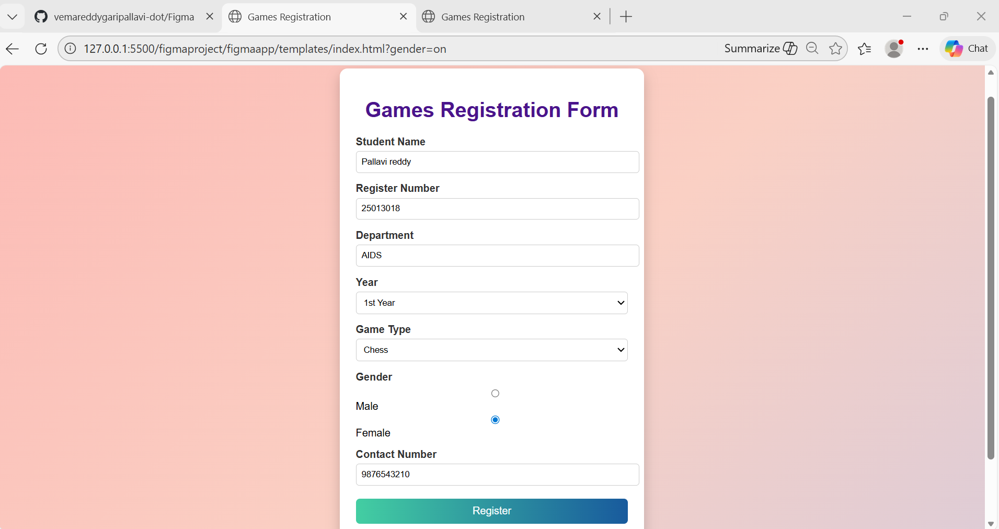

# Ex09 Event Registration Web Application
## Date:24-12-25

## AIM:
To design, develop and deploy a web application for event registration.

## DESIGN STEPS:

### Step 1:
Create a new frame.

### Step 2:
Select any one preset size of your choice.

### Step 3:
Select the shapes you need.

### Step 4:
Import images as needed.

### Step 5:
Create pages based on your need and link them.

### Step 6:

Validate the HTML and CSS code.

### Step 6:

Publish the website in the given URL.

## DESIGN TOOL:
Figma

## CODE:
figma.html
```
<!DOCTYPE html>
<html lang="en">
<head>
    <meta charset="UTF-8">
    <title>Games Registration</title>
    <link rel="stylesheet" href="style.css">
</head>
<body>

    <div class="container">
        <h1>Games Registration Form</h1>

        <form>
            <label>Student Name</label>
            <input type="text" placeholder="Enter your name" required>

            <label>Register Number</label>
            <input type="text" placeholder="Enter register number" required>

            <label>Department</label>
            <input type="text" placeholder="Enter department">

            <label>Year</label>
            <select>
                <option>1st Year</option>
                <option>2nd Year</option>
                <option>3rd Year</option>
                <option>4th Year</option>
            </select>

            <label>Game Type</label>
            <select>
                <option>Cricket</option>
                <option>Football</option>
                <option>Badminton</option>
                <option>Chess</option>
                <option>Volley Ball</option>
            </select>

            <label>Gender</label>
            <div class="radio">
                <input type="radio" name="gender"> Male
                <input type="radio" name="gender"> Female
            </div>

            <label>Contact Number</label>
            <input type="tel" placeholder="Enter mobile number">

            <button type="submit">Register</button>
            <button type="reset" class="reset">Reset</button>
        </form>
    </div>

</body>
</html>

```
style.css
```
body {
    font-family: Arial, sans-serif;
    background: linear-gradient(135deg, #ff9a9e, #fad0c4, #a1c4fd, #c2e9fb);
    background-size: 400% 400%;
    animation: gradientBG 10s ease infinite;
}

/* Animated gradient */
@keyframes gradientBG {
    0% { background-position: 0% 50%; }
    50% { background-position: 100% 50%; }
    100% { background-position: 0% 50%; }
}

.container {
    width: 420px;
    margin: 40px auto;
    background-color: #ffffff;
    padding: 25px;
    border-radius: 12px;
    box-shadow: 0 8px 20px rgba(0,0,0,0.2);
}

h1 {
    text-align: center;
    color: #4a148c;
}

label {
    display: block;
    margin-top: 15px;
    font-weight: bold;
    color: #333;
}

input, select {
    width: 100%;
    padding: 8px;
    margin-top: 5px;
    border-radius: 5px;
    border: 1px solid #ccc;
}

.radio {
    margin-top: 5px;
}

button {
    width: 100%;
    padding: 10px;
    margin-top: 20px;
    background: linear-gradient(to right, #43cea2, #185a9d);
    color: white;
    border: none;
    border-radius: 6px;
    font-size: 16px;
    cursor: pointer;
}

.reset {
    background: linear-gradient(to right, #bdbdbd, #757575);
}

button:hover {
    opacity: 0.9;
}

```

## OUTPUT:


## RESULT:
The program to design, develop and deploy a web application for event registration is completed successfully.
